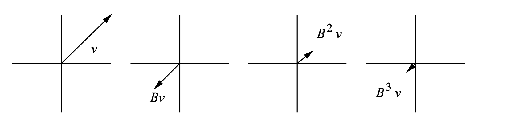
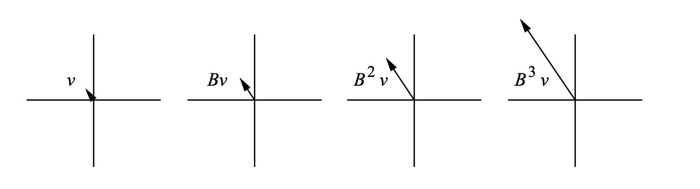
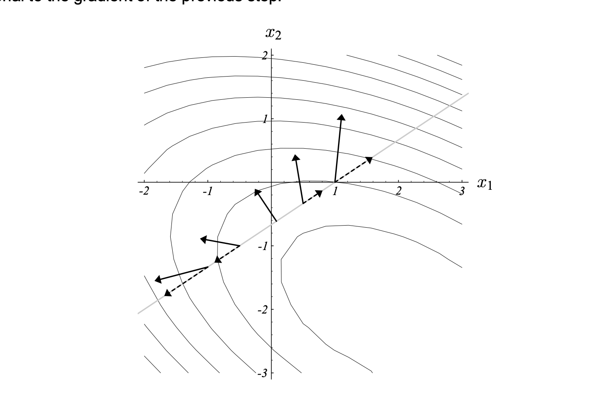

# Calculus

## Taylor Series

$$
f(x) = \sum_{n} \frac{f^{n}(a)(x-a)^n}{n!}
$$

Simple Proof:

Suppose $f(x)$ is a polynomial of $c_0 + c_1(x-a) + c_2(x-a)^2 + c_3(x-a)^3 + \cdots$

Their derivatives are:

$$
\begin{align*}
f'(x) &= c_1 + 2c_2(x-a) + 3c_3(x-a)^2 + \cdots \\
f''(x) &= 2c_2 + 6c_3(x-a) + 12c_4(x-a)^2 + \cdots \\
f'''(x) &= 6c_3 + 24c_4(x-a) + 60c_5(x-a)^2 + \cdots \\
\end{align*}
$$

Let $x = a$, we get:

$$
\begin{align*}
f(a) &= c_0 \\
f'(a) &= c_1 \\
f''(a) &= 2c_2 \\
f'''(a) &= 6c_3 \\
\end{align*}
$$

Thus, we can get the coefficients of the polynomial by the derivatives at $x = a$. And the function can be rewritten as:

$$
\begin{align*}
f(x) &= f(a) + f'(a)(x-a) + \frac{f''(a)}{2}(x-a)^2 + \frac{f'''(a)}{6}(x-a)^3 + \cdots \\
\end{align*}
$$

## Change of Variables

### Single Dimension
Formula: 

$$
\int_{g(a)}^{g(b)} f(u) du = \int_{a}^{b} f(g(x)) g'(x) dx, \text{ where } u = g(x)
$$

Suppose we have a function $F$, and its derivative is $f$, and a change of variable $u = g(x)$. Let $L(x) = F(g(x))$, then we have:

$$
\begin{align*}
L'(x) &= \frac{d}{dx} F(g(x)) \\
&= f(g(x)) g'(x)
\end{align*}
$$

$$
\begin{align*}
L(b) - L(a) &= \int_{a}^{b} L'(x) dx \\
&= \int_{a}^{b} f(g(x)) g'(x) dx \\
\end{align*}
$$

We know that $L(b) = F(g(b))$ and $L(a) = F(g(a))$, so we have:

$$
\begin{align*}
F(g(b)) - F(g(a)) &= \int_{g(a)}^{g(b)} f(u) du  \\
\int_{g(a)}^{g(b)} f(u) du &= \int_{a}^{b} f(g(x)) g'(x) dx
\end{align*}
$$

### Multivariate

## Multivariate Calculus

### Gradient

Suppose along a curve $\vec{r}(t) =(x(t),y(t))$ we have a function $f(x(t),y(t)) = C$, where C a constant represent the height of the level curve.

Taking the derivative of both side with respect to $t$, we get:

$$
\frac{d}{dt} f(x(t),y(t)) = \frac{\partial f}{\partial x} \frac{dx}{dt} + \frac{\partial f}{\partial y} \frac{dy}{dt} = 0
$$

This is the dot product of the gradient of $f$ and the tangent vector of the curve.

$$
\nabla f \cdot \frac{d\vec{r}}{dt} = 0
$$

To illustrate:

$\frac{d\vec{r}}{dt}$ is the tangent vector of the level curve function $f(x,y) = C$, going in the direction of the tangenet vector, $z$ remains constant, which is 1 shown in the picture. However, the gradient of $f$ is perpendicular to the level curve. Based on the observation, we can see that gradient is pointing in the steepest direction of the level curve.

### Lagrange Multiplier
Give a constraint $g(x) = 0$, we want to find the maximum or minimum of a function $f(x)$.
$$
\begin{align*}
\max_{x} f(x) \\
s.t. \quad g(x) = 0
\end{align*}
$$
Formulate the problem as the Lagrangian function:
$$
\begin{align*}
L(x, \lambda) = f(x) - \lambda g(x)
\end{align*}
$$
Take the gradient of $L$ with respect to $x$ and $\lambda$, we get:
$$
\begin{align*}
\nabla L = \nabla f - \lambda \nabla g = 0 \\
\end{align*}
$$

Solve for $\lambda$ and $x$, we get the critical points.
**Why for a constrained optimization problem, the critical points are found when the gradient of the objective function is parallel to the gradient of the constraint?**

At any possible level of $c=f(x)$,  $f(x)$ and $g(x)$ are following the same orientation, otherwise, $f(x)$ is not constrained to the level curve of $g(x)$. Thus, the tangent vector of $f(x)$ and $g(x)$ are parallel. This implies that the gradient of $f(x)$ and $g(x)$ are also parallel.

Therefore, we can say that the critical points are found when the gradient of the objective function is parallel to the gradient of the constraint.

# Linear Algebra

## Eigenvalues and Eigenvectors

### Intuition

An eigenvector $v$ of a matrix $A$ is a vector that is scaled by a scalar $\lambda$ when it is multiplied by $A$. $v$ might be changed in direction and/or magnitude when it is multiplied by $A$, but the rotation will be the same.

$$
A v = \lambda v
$$

### Why do we care?

Eigenvectors can be important for iterative methods. For example, iterative methods often depend on applying a matrix $A$ repeatedly. If $A$ has an eigenvector $v$ with eigenvalue $\lambda$, then $A^k v = \lambda^k v$. This can be very useful for understanding the behavior of the iterative method.

If $\left|\lambda\right| < 1$, the iterative method will converge to 0.

If $\left|\lambda\right| > 1$, the iterative method will diverge.

### Properties

- For any symmetric matrix $A$ of $R^{n \times n}$, there exists an orthonormal basis of $R^n$ consisting of eigenvectors of $A$.

- If $A$ is a positive-definite matrix, then all the eigenvalues of $A$ are positive.

### Spectral Radius of a Matrix

The spectral radius of a matrix $A$ is the largest eigenvalue of $A$ in magnitude.

$$
\rho(A) = \max_{\lambda \in \sigma(A)} \left|\lambda\right|
$$

Suppose that $v_1, v_2, \cdots, v_n$ of $A$ form the basis of $R^n$. And let $x = \sum_{i=1}^n  v_i$. Then:

$$
\begin{align*}
A^{k} x &= A^{k} v_1 + A^{k} v_2 + \cdots + A^{k} v_n \\
&= \lambda_1^k v_1 + \lambda_2^k v_2 + \cdots + \lambda_n^k v_n \\
\end{align*}
$$

So, if $\left|\lambda_i\right| < 1$ for all $i$, then $A^k x$ will converge to 0. However, if $\left|\lambda_i\right| > 1$ for some $i$, then $A^k x$ will diverge to infinity.

### Jacobi Iteration

**We want to split a square matrix $A$ into parts that has a smaller spectral radius, so that the iteration will converge.**

Consider splitting a square matrix $A$ into two parts:

$$
A = D + E, \text{ where } D \text{ is a diagonal matrix and } E \text{ is a strict upper triangular matrix} 
$$

Then:

$$
\begin{align*}
A x &= b \\
(D + E) x &= b \\
D x &= b - E x \\
x &= D^{-1} (b - E x)
\end{align*}
$$

Let $B = -D^{-1} E$ and $z = D^{-1} b$, we have:

$$
x = Bx + z, \quad \text{stationary point}
$$

Let $x^{(k)}$ be the $k$-th iteration of $x$, we have:

$$
x_{(k+1)} = B x_{(k)} + z, \quad \text{iteration before convergence}
$$

Let $e_{(i)} = x_{(i)} - x$ to indicate the error of $x$ at the $i$-th iteration to the stationary point $x$, we have:

$$
\begin{align*}
x_{(i+1)} &= B x_{(i)} + z \\
x_{(i+1)} &= B (e_{(i)} + x) + z\\
x_{(i+1)} &= B e_{(i)} + Bx + z\\
x_{(i+1)} &= B e_{(i)} + x \quad \text{since } Bx + z = x \\
x_{(i+1)} - x &= B e_{(i)} \\
e_{(i+1)} &= B e_{(i)}
\end{align*}
$$

Based on the above derivation, we can see that the number of iterations for take for the error to converge is dependent on the spectral radius of $B$.

#### Concrete Example

Consider the following matrix:

$$
A = \begin{bmatrix}
3 & 2 \\
2 & 6
\end{bmatrix},
b = \begin{bmatrix}
2 \\
-8
\end{bmatrix}
$$

We can split $A$ into $D$ and $E$ as follows:

$$
D = \begin{bmatrix}
3 & 0 \\
0 & 6
\end{bmatrix} \implies D^{-1} = \begin{bmatrix}
\frac{1}{3} & 0 \\
0 & \frac{1}{6}
\end{bmatrix},
E = \begin{bmatrix}
0 & 2 \\
-2 & 0
\end{bmatrix}
$$

The  values for $A$ are:

$$
\lambda_1 = 7, \quad \lambda_2 = 2
$$

However, the eigenvalues  for $B=-D^{-1}E$ are:

$$
\lambda_1 = -\frac{\sqrt{2}}{3}, \quad \lambda_2 = \frac{\sqrt{2}}{3}
$$

As we can see, applying the Jacobi iteration method, we can reduce the spectral radius of $B$ from 7 to $\frac{\sqrt{2}}{3}$, which is a significant reduction.

## Quadratic Form

### Basic Form
$$
\begin{align*}
f(x) &= x^T A x, \text{ where }

A &= \begin{bmatrix}
a_{11} & a_{12} \\
a_{21} & a_{22}
\end{bmatrix} \text{ and }
x &= \begin{bmatrix}
x_1 \\ x_2
\end{bmatrix}
\end{align*}
$$

Then, we can expand the quadratic form as:

$$
\begin{align*}
f(x) &= x_1 a_{11} x_1  + x_1 a_{12} x_2 + x_2 a_{21} x_1 + x_2 a_{22} x_2 \\
&=  a_{11}x_1^2 + (a_{12} + a_{21}) x_1 x_2  + a_{22}x_2^2 \\
& = a_{11}x_1^2 + 2a_{12} x_1 x_2 + a_{22}x_2^2 \quad \text{if } A \text{ is symmetric}
\end{align*}
$$

### Positive Definite

A matrix $A$ is positive definite if for all $x \neq 0$, $x^T A x > 0$.

### Convert to Linear Form

Let $f(x) = \frac{1}{2} x^T A x - b^T x + c$, we can convert it to a linear form by differentiating with respect to $x$ and setting the gradient to 0.

$$
\begin{align*}
f'(x) &= \frac{1}{2} (A + A^T) x - b \\
\end{align*}
$$

If $A$ is symmetric, we have:

$$
\begin{align*}
f'(x) &= A x - b \\
\end{align*}
$$

Setting the gradient to 0, we get:

$$
\begin{align*}
A x &= b \\
\end{align*}
$$

#### Proof that $Ax=b$ is the minimum of $f(x)$ if $A$ is positive definite and symmetric

Let $x+e$ be a perturbation of $x$, we have:

$$
\begin{align*}
f(x+e) &= \frac{1}{2} (x+e)^T A (x+e) - b^T (x+e) + c \\
&= \frac{1}{2} (x^T A x + 2 x^T A e + e^T A e) - b^T x - b^T e + c \quad \text{since } A \text{ is symmetric} \\
&= \frac{1}{2} (x^T A x  -b^T x + c) + x^T A e + \frac{1}{2} e^T A e - b^T e \\
&= f(x) + b^T e + \frac{1}{2} e^T A e - b^T e  \quad \text{since } x^TA=b^T\\
&= f(x) + \frac{1}{2} e^T A e \\
\end{align*}
$$

Since $A$ is positive definite, $\frac{1}{2} e^T A e > 0$ for all $e \neq 0$. Therefore, $f(x+e) > f(x)$ for all $e \neq 0$. Hence, $x$ is the minimum of $f(x)$.

##  Steepest Gradient Descent

We take a series of steps $x_{(1)}, x_{(2)}, \cdots, x_{(k)}$ until we are satsfied that $x_{(k)}$ is close enough to the minimum of $f(x)$.

When we take a step, we choose the direction in which decreases most quickly, which is the direction opposite to $f'(x)$. According to the notation we used in the previous section, the direction is $-f'(x_{(i)})=b - Ax_{(i)}$.

### Notation

- Direction of the steepest descent: $d_{(i)} = -f'(x_{(i)}) = b - Ax_{(i)}$
- error: $e_{(i)} = x_{(i)} - x$
- residual: $r_{(i)} = b - Ax_{(i)} = -Ae_{(i)} = -f'(x_{(i)})$
- $\alpha_{(i)}$: step size at $i$-th iteration
- $x_{(i+1)} = x_{(i)} + \alpha_{(i)} r_{(i)} \quad $ the update of $x$ at $i$-th iteration

### Choice of step size

We can choose the step size $\alpha_{(i)}$ to be the one that minimizes $f(x_{(i+1)})$. From basic calculus, we know that the minimum of $f(x_{(i+1)})$ is found when the derivative of $f(x_{(i+1)})$ with respect to $\alpha_{(i)}$ is 0.

By chain rule, we have:

$$
\begin{align*}
\frac{d}{d\alpha_{(i)}} f(x_{(i+1)}) &= \frac{d}{d\alpha_{(i)}} f(x_{(i)} + \alpha_{(i)} r_{(i)}) \\
&= f'(x_{(i)} + \alpha_{(i)} r_{(i)}) \cdot r_{(i)} \\
&= f'(x_{(i+1)}) \cdot r_{(i)} \\
\end{align*}
$$

From the derivation we can see that the step size $\alpha_{(i)}$ is the solution to the following equation:

$$
\begin{align*}
f'(x_{(i+1)}) \cdot r_{(i)} &= 0 \\
r_{(i+1)}^T \cdot r_{(i)} &= 0 \\
(b-Ax_{(i+1)})^T \cdot r_{(i)} &= 0 \\
(b-A(x_{(i)} + \alpha_{(i)} r_{(i)}))^T \cdot r_{(i)} &= 0 \\
(r_{(i)} - \alpha_{(i)} A r_{(i)})^T \cdot r_{(i)} &= 0 \\
r_{(i)}^T r_{(i)} - \alpha_{(i)} r_{(i)}^T A r_{(i)} &= 0 \\
\alpha_{(i)} &= \frac{r_{(i)}^T r_{(i)}}{r_{(i)}^T A r_{(i)}}
\end{align*}
$$

Putting it all together, we have:

$$
\begin{align*}
r_{(i)} &= b - A x_{(i)} \\
\alpha_{(i)} &= \frac{r_{(i)}^T r_{(i)}}{r_{(i)}^T A r_{(i)}} \\
x_{(i+1)} &= x_{(i)} + \alpha_{(i)} r_{(i)} \\
\end{align*}
$$

Based on the illustration, where as the linear line through the graph is the line of search direction,  we see that $f$ is minimized along the search line where the gradient is perpendicular to the search line.

### Convergence Analysis

#### Single Eigenvector

Consider a eigenvector $x_{(i)}$ with eigenvalue $\lambda$ of $A$, we have:

$$
\begin{align*}
x_{(i+1)} &= x_{(i)} + \alpha_{(i)} r_{(i)} \\
&= x_{(i)} + \frac{r_{(i)}^T r_{(i)}}{r_{(i)}^T A r_{(i)}} r_{(i)} \\
&= x_{(i)} + \frac{r_{(i)}^T r_{(i)}}{\lambda r_{(i)}^T r_{(i)}} (b-\lambda x_{(i)}) \\
&= (1-\alpha_{(i)} \lambda) x_{(i)} + \alpha_{(i)} b \\
\end{align*}
$$

