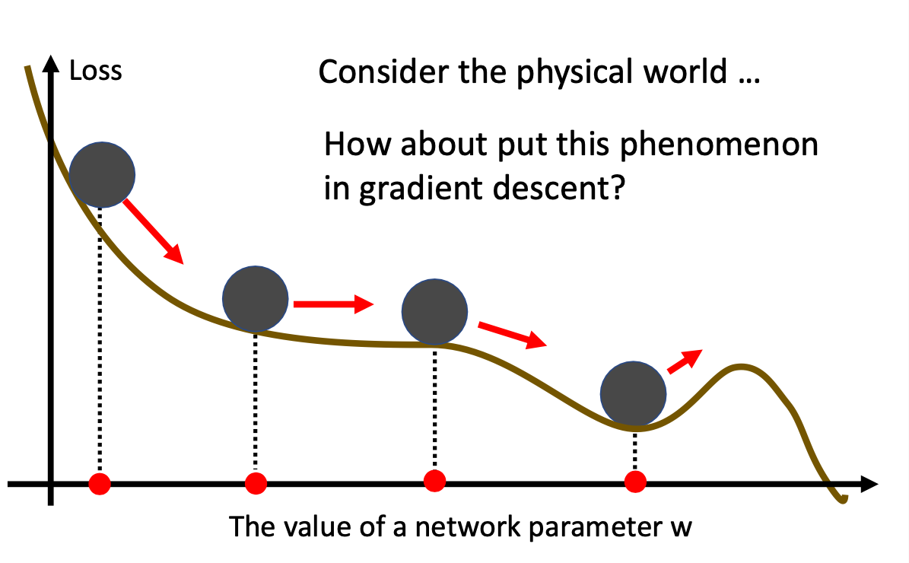

# Supervised Learning

## Classification

Classification is a type of supervised learning where the goal is to predict a categorical label for a given input.

### Softmax Function and Cross Entropy Loss

Softmax function $\frac{e^{z_i}}{\sum_{l=1}^{n} e^{z_l}}$ is a function generally used in the final layer of a classification model. It takes the logits at the final layer and normalizes them to a probability distribution.

Derivative:

Let $\hat{y_i} = \frac{e^{z_i}}{\sum_{l=1}^{n} e^{z_l}}$ 

$$
\begin{align*}
\frac{\partial}{\partial z_j} \hat{y_i} &= \frac{\partial}{\partial z_j} \frac{e^{z_i}}{\sum_{l=1}^{n} e^{z_l}} \\
&= \frac{ \frac{\partial}{\partial z_j} e^{z_i} \cdot \sum_{l=1}^{n} e^{z_l} - e^{z_i} \cdot \frac{\partial}{\partial z_j} \sum_{l=1}^{n} e^{z_l}}{(\sum_{l=1}^{n} e^{z_l})^2} \\
&= \frac{\frac{\partial}{\partial z_j} e^{z_i} \cdot \sum_{l=1}^{n} e^{z_l}}{(\sum_{l=1}^{n} e^{z_l})^2} - \frac{e^{z_i} \cdot e^{z_j}}{(\sum_{l=1}^{n} e^{z_l})^2} \\
&= \frac{\frac{\partial}{\partial z_j} e^{z_i}}{(\sum_{l=1}^{n} e^{z_l})} - \hat{y_i} \hat{y_j} \\
&= \begin{cases} 
\hat{y_i}(1-\hat{y_i}) & \text{if } i=j \text{ because } \frac{\partial}{\partial z_j} e^{z_i} = e^{z_i} \text{ and }  \frac{e^{z_i}}{(\sum_{l=1}^{n} e^{z_l})} = \hat{y_i}\\
-\hat{y_i}\hat{y_j} & \text{if } i \neq j \text{ because } \frac{\partial}{\partial z_j} e^{z_i} = 0
\end{cases}
\end{align*}
$$

#### Why Cross Entropy as loss function for classification problem?

To understand why cross entropy is a good loss function for classification problem, we need to understand how it works with the softmax function.

$$
\begin{align*}
L &= -\sum_{i=1}^{n} y_i \log(\hat{y_i}) \\
\end{align*}
$$

Take the derivative of the loss function with respect to the logits $z_i$:

$$
\begin{align*}
\frac{\partial L}{\partial \hat{y_i}} &= \frac{\partial}{\partial \hat{y_i}} (-\sum_{i=1}^{n} y_i \log(\hat{y_i})) \\
&= -\frac{y_i}{\hat{y_i}}
\end{align*}
$$

Combine the result with the softmax function, we get:

$$
\begin{align*}
\frac{\partial L}{\partial \hat{y_i}} \cdot \frac{\partial \hat{y_i}}{\partial z_j} = \begin{cases} 
y_i(\hat{y_j} - 1) & \text{if } i=j  \\
y_i\hat{y_j} & \text{if } i \not=j  \\
\end{cases}
\end{align*}
$$

$$
\begin{align*}
\frac{\partial L}{\partial z_j} &= \sum_{i=1}^{n} \frac{\partial L}{\partial \hat{y_i}} \cdot \frac{\partial \hat{y_i}}{\partial z_j} \\
&= \sum_{i=1, i\not=j}^{n} y_i(\hat{y_j})  +  (\hat{y_j} - 1)y_j  \\
&= (\hat{y_i}) [(\sum_{i=1}^{n} y_i) - y_j] +  (\hat{y_j}y_j - y_j)  \\
&= \hat{y_j}(1- y_j) +  (\hat{y_j}y_j - y_j) &\text{ because } \sum_{i=1}^{n} y_i = 1 \\
&= \hat{y_j} - y_j
\end{align*}
$$

As we can see, the gradient of the loss function with respect to the logits is numerically stable and easy to compute. 

# Optimization

## Local Minima vs Saddle Point

A local minimum is a point where the function value is less than all nearby points, but may not be the global minimum. A saddle point is a point that is a local minimum in one direction but a local maximum in another direction.

To distinguish between them, we can look at the Taylor series expansion around a critical point (where gradient is zero):

$$
\begin{align*}
f(x) &\approx f(x_0) + \nabla f(x_0)^T(x-x_0) + \frac{1}{2}(x-x_0)^T H(x_0)(x-x_0)  \\
&\approx f(x_0) + \frac{1}{2}(x-x_0)^T H(x_0)(x-x_0) 
\end{align*}
$$

where H(x_0) is the Hessian matrix at x_0. At a critical point:

- If all eigenvalues of H(x_0) are positive → Local minimum
- If all eigenvalues of H(x_0) are negative → Local maximum  
- If eigenvalues have mixed signs → Saddle point

## Batch Normalization

### Small Batch vs Large Batch

- Calculation Speed Per Batch: Due to the advancement of matrix parallelization, the training speed per batch is almost the same for small and large batch. The performance difference would become noticiable when the batch size became too large.
- Training Speed Per Epoch: Because larger batch size calculation can be almost as fast as small batch, the training speed per epoch depeding how many updates needed to be performed per batch. Thus, larger batch size has a faster training speed per epoch.
- Convergence: Small batch in general has a better convergence. Due to the noise in the gradient, small batch has a higher variance in the gradient. It is less likely to get stuck in a local&sharp minimum.

### Normalization

## Momentum

In the phyiscal world, momentum is the inertia of an object. In the picture above, the ball will continue to roll down the hill, and the momentum will overcome the slight upward slope and continue to roll down.

### Gradient Descent with Momentum

$$
\begin{align*}
\text{Starting at } \theta^0 \\
\text{Compute Gradient } g^0 \\
\text{Update Movement } m^0 &=  \eta g^0  \\
\text{Update Parameter } \theta^1 &= \theta^0 - m^0 \\
\text{Compute Gradient } g^1 \\
\text{Update Movement } m^1 &=  \eta g^1 - \lambda m^0   \\
\text{Update Parameter } \theta^2 &= \theta^1 - m^1  \\
\end{align*}
$$

## Adaptive Learning Rate

Why need adaptive learning rate?

- (Need for Gradually Decreased Learning Rate) At the final stage of training, we might not need the learning rate to be as large as the initial stage. Because a plausible trajectory of training of loss function goes like at the initial stage, we want the parameters to explore the space more. Thus, parameters need to have a larger learning rate to jump from one area to another. However, at the final stage, most parameters are likely to be stuck at a area such that they are unlikely to get out with more iterations of training. Thus, we want them to converge to the local minima. And for this case, smaller learning rate is preferred to get the result more accurate.
- (Different Learning Rate for Different Parameters) Different parameters have different gradients. For example, parameters with large gradient, they are likely do not need large learning rate to get out of the local minima. Instead, a large learning rate might lead to overshoot and oscillation. 

Thus, we want to introduce a learning rate hyper parameter for adaptive adjustment. And turn the parameter update into:

$$
\theta^{t+1} = \theta^t - \frac{\eta }{\sigma^t} g^t
$$

### AdaGrad

$$
\sigma^t =\sqrt{\frac{1}{t+1}\sum_{i=0}^{t} (g_i)^2}
$$

### RMSProp

$$
\sigma^t = \sqrt{\alpha(\sigma^{t-1})^2 + (1-\alpha)(g^t)^2}
$$

### Adam

### Learning Rate Scheduling

# Math

## Eigenvalues and Eigenvectors

## Taylor Series

$$
f(x) = \sum_{n} \frac{f^{n}(a)(x-a)^n}{n!}
$$

Simple Proof:

Suppose $f(x)$ is a polynomial of $c_0 + c_1(x-a) + c_2(x-a)^2 + c_3(x-a)^3 + \cdots$

Their derivatives are:

$$
\begin{align*}
f'(x) &= c_1 + 2c_2(x-a) + 3c_3(x-a)^2 + \cdots \\
f''(x) &= 2c_2 + 6c_3(x-a) + 12c_4(x-a)^2 + \cdots \\
f'''(x) &= 6c_3 + 24c_4(x-a) + 60c_5(x-a)^2 + \cdots \\
\end{align*}
$$

Let $x = a$, we get:

$$
\begin{align*}
f(a) &= c_0 \\
f'(a) &= c_1 \\
f''(a) &= 2c_2 \\
f'''(a) &= 6c_3 \\
\end{align*}
$$

Thus, we can get the coefficients of the polynomial by the derivatives at $x = a$. And the function can be rewritten as:

$$
\begin{align*}
f(x) &= f(a) + f'(a)(x-a) + \frac{f''(a)}{2}(x-a)^2 + \frac{f'''(a)}{6}(x-a)^3 + \cdots \\
\end{align*}
$$

## Change of Variables

### Single Dimension
Formula: 

$$
\int_{g(a)}^{g(b)} f(u) du = \int_{a}^{b} f(g(x)) g'(x) dx, \text{ where } u = g(x)
$$

Suppose we have a function $F$, and its derivative is $f$, and a change of variable $u = g(x)$. Let $L(x) = F(g(x))$, then we have:

$$
\begin{align*}
L'(x) &= \frac{d}{dx} F(g(x)) \\
&= f(g(x)) g'(x)
\end{align*}
$$

$$
\begin{align*}
L(b) - L(a) &= \int_{a}^{b} L'(x) dx \\
&= \int_{a}^{b} f(g(x)) g'(x) dx \\
\end{align*}
$$

We know that $L(b) = F(g(b))$ and $L(a) = F(g(a))$, so we have:

$$
\begin{align*}
F(g(b)) - F(g(a)) &= \int_{g(a)}^{g(b)} f(u) du  \\
\int_{g(a)}^{g(b)} f(u) du &= \int_{a}^{b} f(g(x)) g'(x) dx
\end{align*}
$$

### Multivariate

## Multivariate Calculus

### Gradient

Suppose along a curve $\vec{r}(t) =(x(t),y(t))$ we have a function $f(x(t),y(t)) = C$, where C a constant represent the height of the level curve.

Taking the derivative of both side with respect to $t$, we get:

$$
\frac{d}{dt} f(x(t),y(t)) = \frac{\partial f}{\partial x} \frac{dx}{dt} + \frac{\partial f}{\partial y} \frac{dy}{dt} = 0
$$

This is the dot product of the gradient of $f$ and the tangent vector of the curve.

$$
\nabla f \cdot \frac{d\vec{r}}{dt} = 0
$$

To illustrate:

$\frac{d\vec{r}}{dt}$ is the tangent vector of the level curve function $f(x,y) = C$, going in the direction of the tangenet vector, $z$ remains constant, which is 1 shown in the picture. However, the gradient of $f$ is perpendicular to the level curve. Based on the observation, we can see that gradient is pointing in the steepest direction of the level curve.

### Lagrange Multiplier
Give a constraint $g(x) = 0$, we want to find the maximum or minimum of a function $f(x)$.
$$
\begin{align*}
\max_{x} f(x) \\
s.t. \quad g(x) = 0
\end{align*}
$$
Formulate the problem as the Lagrangian function:
$$
\begin{align*}
L(x, \lambda) = f(x) - \lambda g(x)
\end{align*}
$$
Take the gradient of $L$ with respect to $x$ and $\lambda$, we get:
$$
\begin{align*}
\nabla L = \nabla f - \lambda \nabla g = 0 \\
\end{align*}
$$

Solve for $\lambda$ and $x$, we get the critical points.

**Why for a constrained optimization problem, the critical points are found when the gradient of the objective function is parallel to the gradient of the constraint?**

At any possible level of $c=f(x)$,  $f(x)$ and $g(x)$ are following the same orientation, otherwise, $f(x)$ is not constrained to the level curve of $g(x)$. Thus, the tangent vector of $f(x)$ and $g(x)$ are parallel. This implies that the gradient of $f(x)$ and $g(x)$ are also parallel.

Therefore, we can say that the critical points are found when the gradient of the objective function is parallel to the gradient of the constraint.

# Statistics

## Probability Distribution

### Kullback-Leibler Divergence

kl divergence is a measure of how one probability distribution diverges from another.

$$
D_{KL}(P || Q) = \int_x P(x) \log{\frac{P(x)}{Q(x)}} dx
$$

### Jensen-Shannon Divergence

JS divergence is a symmetric measure of how one probability distribution diverges from another.

$$
D_{JS}(P || Q) = \frac{1}{2}D_{KL}(P || \frac{P+Q}{2}) + \frac{1}{2}D_{KL}(Q || \frac{P+Q}{2})
$$

### Jensen's inequality

$$
\mathbb{E}[f(x)] \geq f(\mathbb{E}[x])
$$

# Neural Network

## Feed Forward Neural Network 

## Convolutional Neural Network

### Why not use fully connected layer for image classification?

- Suppose we have a 100x100 RGB image and we are using a fully connected layer. By flattening the image pixels, we get a input vector of 30000 features. Feeding it to a fully connected layer with 1000 neurons, the number of weights will be 30000 * 1000 = 30,000,000, which is **computationally expensive**. 

- Not only that, for most trainings, the number of neurons of the first layer is often larger than the number of input features. Otherwise, the network is likely to be underfitting. However, if we set more than 30000 neurons for the first layer, it is likely to be overfitting.

So, to train a image task with fully-connected layer architecture, it is facing the problem of **computationally expensiveness** and it is **prone to overfitting**.

### Observation of Image

- If we think neuron as a representation of a pattern of the image, it might not need the whole image for its computation. Distinct patterns can be captured at a smaller region of the image.
- The same pattern might appear in different locations of the image.

### Simplication of the Problem

- Instead of flattening the image into a 1-D vector, we can use the concept of **receptive field** to capture the regional pattern of the image
- We can share the weights of filters, so that the reception fields with similar patterns can receive similar values on the feature map.

### Architecture of Convolutional Neural Network

- kernel: also called filter, a small matrix of weights to perform convolution opertion on the receptive field
- stride: the number of pixels the kernel moves by
- padding: the number of pixels added to the side of the image

- feature map: the result of applying a kernel to an image
- channel: the number of feature maps

**Estimate of the number of parameters in a convolutional layer:**

Number of parameters = (Input channel) x (Output channel) x (Kernel size)

Suppose we have a image size of 100x100, 3x3 kernel, 1 stride, 1 padding, 3 input channels, and 64 output channels,
- Input channel = 3
- Output channel = 64
- Kernel size = 3 x 3 = 9

Thus, the number of parameters is 3 x 64 x 9 = 1728, which is much less than the 100x100x3 = 30000 for a fully connected layer.

**Pooling:**

Pooling is a technique to reduce the spatial dimensions of the feature map.

But the recent trend uses pooling less and less due to the redundancy of computation.

### Limitation of Convolutional Neural Network

- Convolutional Neural Network is not invariant to the scaling and rotation of the image.
- We often use data augmentation to improve the performance of the model, but often it is not enough.

## Recurrent Neural Network

## Transformer

# Activation Functions

## Sigmoid

**Function:**

$$
\begin{align*}
f(x) = \frac{1}{1 + e^{-x}}
\end{align*}
\\
$$

**Derivative:**

$$
\begin{align*}
f'(x) &= \frac{e^{-x}}{(1 + e^{-x})^2} \\
&= f(x)(1 - f(x))
\end{align*}
\\
$$

## Tanh

**Define:**

$$
\begin{align*}
 \sigma(x) = sigmoid(x) = \frac{1}{1 + e^{-x}}
\\
\end{align*}
\\
$$

**Function:**

$$
\begin{align*}
f(x) &= 2 \cdot \sigma(2x) - 1  \\
&= \frac{e^x - e^{-x}}{e^x + e^{-x}}
\end{align*}
\\
$$

**Derivative:**

$$
\begin{align*}
f'(x) &= 4 \sigma'(2x) \\
&= 4[\frac{e^{-2x}}{(1 + e^{-2x})^2}] \\
\end{align*}
\\
$$

**Derivative Comparison against sigmoid:**

$$
\begin{array}{|c|c|c|}
\hline
x & \text{sigmoid}'(x) & \text{tanh}'(x) \\
\hline
-10 & 0.000045 & 0.000004 \\
-5 & 0.0067 & 0.0018 \\
-2 & 0.105 & 0.070 \\
-1 & 0.197 & 0.240 \\
0 & 0.250 & 1.000 \\
1 & 0.197 & 0.240 \\
2 & 0.105 & 0.070 \\
5 & 0.0067 & 0.0018 \\
10 & 0.000045 & 0.000004 \\
\hline
\end{array}
$$

**Why tanh is (slightly) better than sigmoid:**

Based on the derivative, we can see that tanh has a steeper gradient around 0, and the range of tanh derivative is larger than sigmoid ([0, 1] vs [0, 0.25]). Despite it has a worse gradient vanishing problem, tanh is still better than sigmoid for most cases.

**Issue of sigmoid and tanh:**

- Vanishing gradient problem (when the input is too large or too small)
- Sensitive to weight initialization (the initial weight has profound impact to the gradient due to its unbalanced gradient distribution)
- Computational Complexity (its derivative function is more complex than ReLU)
- Less Sparse Activation (Every neuron is activated at every layer, which might lead to overfitting)

## ReLU

**Function:**

$$
\begin{align*}
f(x) = \max(0, x)
\end{align*}
\\
$$

