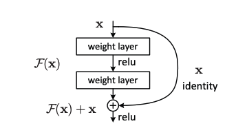

# Optimizer

## ADAM: A METHOD FOR STOCHASTIC OPTIMIZATION https://arxiv.org/pdf/1412.6980

### Algorithm:


### Novelty:

In comparison with adagrad and RMSProp, Adam introduces the concept of second moment of the gradient to stabilize the gradient update. Theoretically and empirically, it is successful at smoothing the overshooting problem.

### Explanation:

**First Moment:**

$$
\begin{align*}
m_t &= \beta_1 m_{t-1} + (1-\beta_1) g_t \\
 &=  (1-\beta_1) \sum_{i=0}^{t} \beta_1^{t-i} g_i
\end{align*}
$$

Let $l = (1-\beta_1)\sum_{i=0}^{t} \beta_1^{t-i} ( g_i - g_t)$, then

$$
\begin{align*}
E[m_t] & = E[g_t] (1-\beta_1) \sum_{i=0}^{t} \beta_1^{t-i} + l\\
& = E[g_t] (1-\beta_1) (\frac{1-\beta_1^t}{1-\beta_1})  + l& \text{(Geometric Series)} \\ 
& = E[g_t] (1-\beta_1^t) + l
\end{align*}
$$


If $g$ is stationary, $l$ = 0. Even if $g$ is non-stationary, the author argued that $l$ is relatively small. Due to the exponential decay factor $\beta_1$, the difference of the early timestep is almost negligible.

So, by dividing $m_t$ by $1-\beta_1^t$, we can get the unbiased estimate of the first moment $E[\hat{m_t}] \approx E[g_t]$.

**Second Moment:**

$$
\begin{align*}
v_t &= \beta_2 v_{t-1} + (1-\beta_2) g_t^2 \\
&= (1-\beta_2) \sum_{i=0}^{t} \beta_2^{t-i} g_i^2
\end{align*}
$$

$$
\begin{align*}
E[v_t] & = E[g_t^2] (1-\beta_2) \sum_{i=0}^{t} \beta_2^{t-i} + l \\
& = E[g_t^2] (1-\beta_2) (\frac{1-\beta_2^t}{1-\beta_2}) + l & \text{(Geometric Series)} \\
& = E[g_t^2] (1-\beta_2^t) + l
\end{align*}
$$

Similar to the first moment, we treat $l$ as a negligible term.

So, by dividing $v_t$ by $1-\beta_2^t$, we can get the unbiased estimate of the second moment $E[\hat{v_t}] \approx E[g_t^2]$.

**Why $\frac{\hat{m_t}}{\sqrt{\hat{v_t}}}$ works?**

- It makes the gradient update $\alpha\frac{\hat{m_t}}{\sqrt{\hat{v_t}}}$ sit at a bounded region (estimated) [-1, 1] because $\frac{\hat{m_t}}{\sqrt{\hat{v_t}}} \approx \frac{E[g_t]}{\sqrt{E[g_t^2]}} \lessapprox 1$

- Second moment represents the variance of the gradient. When the variance is large, it means it is uncertain about the true direction of the gradient to the local optimum. So, we want it to take a smaller step in case of overshooting from the local minima.


# Convolutional Neural Networks

## Spatial Transformer Networks  https://arxiv.org/pdf/1506.02025


### Novelty:

- Spatial Transformer Networks can be used as a pre-processing step to the CNN to make it more robust to the spatial transformation.
- The spatial transformer network (STN) is often used at the first layer of the network. It transforms the input image to a canonical form, and then feed into the CNN.
- Affine transformation is used to transform the input image. And the transformation matrix is learned by the network.

### Architecture:

The spatial transformer network (STN) consists of three parts:

1. Localization Network:
    - It is a network (can be a CNN, FCN, RNN, etc.) that outputs the parameters for the affine transformation matrix.

2. Grid Generator (Affine Transformation):
    - Apply the affine transformation to the input image.

3. Grid Sampler:
    - It samples the input image using the grid of coordinates.
    - A common sampling method is bilinear interpolation.

### Image Comparion between original and STN:


Based on the above image, we can see that the STN is able to transform the input image to a "canonical form". In which, the images of the same digits are more aligned in terms of rotation. We can conclude that STN helps to mitigate the problem of the CNN being sensitive to the spatial transformation like rotation.

### Code:

```python

class Net(nn.Module):
    def __init__(self):
        super(Net, self).__init__()
        self.conv1 = nn.Conv2d(1, 10, kernel_size=5)
        self.conv2 = nn.Conv2d(10, 20, kernel_size=5)
        self.conv2_drop = nn.Dropout2d()
        self.fc1 = nn.Linear(320, 50)
        self.fc2 = nn.Linear(50, 10)

        # Spatial transformer localization-network
        self.localization = nn.Sequential(
            nn.Conv2d(1, 8, kernel_size=7),
            nn.MaxPool2d(2, stride=2),
            nn.ReLU(True),
            nn.Conv2d(8, 10, kernel_size=5),
            nn.MaxPool2d(2, stride=2),
            nn.ReLU(True)
        )

        # Regressor for the 3 * 2 affine matrix
        self.fc_loc = nn.Sequential(
            nn.Linear(10 * 3 * 3, 32),
            nn.ReLU(True),
            nn.Linear(32, 3 * 2)
        )

        # Initialize the weights/bias with identity transformation
        self.fc_loc[2].weight.data.zero_()
        self.fc_loc[2].bias.data.copy_(torch.tensor([1, 0, 0, 0, 1, 0], dtype=torch.float))

    # Spatial transformer network forward function
    def stn(self, x):
        xs = self.localization(x)
        xs = xs.view(-1, 10 * 3 * 3)
        theta = self.fc_loc(xs)
        theta = theta.view(-1, 2, 3)

        grid = F.affine_grid(theta, x.size())
        x = F.grid_sample(x, grid)

        return x

    def forward(self, x):
        # transform the input
        x = self.stn(x)

        # Perform the usual forward pass
        x = F.relu(F.max_pool2d(self.conv1(x), 2))
        x = F.relu(F.max_pool2d(self.conv2_drop(self.conv2(x)), 2))
        x = x.view(-1, 320)
        x = F.relu(self.fc1(x))
        x = F.dropout(x, training=self.training)
        x = self.fc2(x)
        return F.log_softmax(x, dim=1)


model = Net().to(device)

```

## Residual Networks https://arxiv.org/pdf/1512.03385


### Novelty:

- Identity Mapping: The theory of the residual block is based on the idea that adding extra layers of identity mapping will not make the performance of the network degrade. Thus, the network can be made deeper without the degradation of the performance.
- Residual Block: The authors leveraged the identiy mapping theory in a clearer way and transformed the problem to be learning residual mappings, which has imrpoved gradient flow.

### Architecture:

**Residual Block:**



As the above image shows, the residual block is a building block of the ResNet. It takes  input $x$ and first outputs $F(x)$. The $F(x)$ is the residual mapping that is learned by the network. By adding the identity mapping $x$, it makes $F(x) + x = H(x)$, where $H(x)$ is the final output and the desired underlying mapping of the residual block.

**Intuition:**

- **Why authors suggested that adding extra layers of identity mapping will not make the performance of the network degrade?**


Suppose we have a shallow network, and a deeper network that is a composition of the shallow network and with added layers of identity mapping, plus a final layer of linear transformation.

As shown in the above image, if the extra layers are identity mapping, then the deeper network will generate the same output at extra layer 2 as the output of the shallow network at layer 2. And theoretically, layer 3 and output layer will get better result with sophisticated training.

Therefore, the deeper network will not degrade the performance of the shallow network.

- **Why $H(x)=F(x)+x$ is better than $F(x)$ from gradient analysis perspective?**

Let $x$ be the output of the previous layers. And $L$ is the loss function of the block.

Gradient of Loss with respect to $x$ for $F(x)$:

$$
\frac{\partial L}{\partial x} = \frac{\partial L}{\partial F(x)} \cdot \frac{\partial F(x)}{\partial x}
$$

Gradient of Loss with respect to $x$ for $H(x)=F(x)+x$:

$$
\frac{\partial L}{\partial x} = \frac{\partial L}{\partial H(x)} \cdot \frac{\partial H(x)}{\partial x} = \frac{\partial L}{\partial H(x)} \cdot (1 + \frac{\partial F(x)}{\partial x})
$$


As we can see that the RHS of the product for $H(x)$ has extra term of 1, this will guarentee the gradient more resilient to be vanished. It becomes obviosus if we consider a longer sequence.
Let $(F_1,F_2,F_3,..., F_n)$ be the sequence of identity mapping functions, and  $(H_1,H_2,H_3,..., H_n)$ be the sequence of residual functions, where $H_i(x)=F_i(x)+x$.

Gradient of Loss with respect to $x$ for $(F_1,F_2,F_3,..., F_n)$:

$$
\begin{align*}
\frac{\partial L}{\partial x} & = \frac{\partial L}{\partial F_n(x)} \cdot \frac{\partial F_n(x)}{\partial x} \\
& = \frac{\partial L}{\partial F_n(x)} \cdot ( \frac{\partial F_{n-1}(x)}{\partial x}) \cdot ( \frac{\partial F_{n-2}(x)}{\partial x}) \cdots ( \frac{\partial F_1(x)}{\partial x}) \\
& =  \frac{\partial L}{\partial F_n(x)} \prod_{i=1}^{n-1}  \frac{\partial F_i(x)}{\partial x}
\end{align*}
$$

Gradient of Loss with respect to $x$ for $(H_1,H_2,H_3,..., H_n)$:

$$
\begin{align*}
\frac{\partial L}{\partial x} & = \frac{\partial L}{\partial H_n(x)} \cdot \frac{\partial H_n(x)}{\partial x} \\
& = \frac{\partial L}{\partial H_n(x)} \cdot (\frac{\partial H_{n-1}(x)}{\partial x}) \cdot ( \frac{\partial H_{n-2}(x)}{\partial x}) \cdots ( \frac{\partial F_1(x)}{\partial x})\\
&= \frac{\partial L}{\partial H_n(x)} \cdot (1 + \frac{\partial F_{n-1}(x)}{\partial x}) \cdot (1 + \frac{\partial F_{n-2}(x)}{\partial x}) \cdots (1 + \frac{\partial F_1(x)}{\partial x}) \\
& = \frac{\partial L}{\partial H_n(x)} \prod_{i=1}^{n-1} (1 + \frac{\partial F_i(x)}{\partial x})
\end{align*}
$$  


As we can see, the graident for identity mapping function is more likely to be vanished. On the other hand, the gradient for residual function will not face the vanishing gradient problem. However, the gradient for residual function is more likely to explode. Based on the empirical experiements, applying the batch normalization to each convolution layer can help to stabilize the gradient.


# Generative Model

## GAN: Generative Adversarial Networks https://arxiv.org/pdf/1406.2661


### Novelty

- Adversarial Training Paradigm: Before GAN, the generative models often relied on the maximum likelihood estimation. GAN introduced a discrimitive network as the adversary to the generative network, which drives the generator to generate the samples that are close to the real samples.
- Implicit density estimation: The generative model is not trained with the explicit density estimation. Instead, it is trained with purely the log-likelihood loss.

### Architecture:

**Components:**
- $G(z)$: The generator network. It takes the noise $z$ as the input and generates the sample $x$.
- $p_z(z)$: The prior distribution of the noise.
- $p_{d}(x)$: The real data distribution.
- $D(x)$: The discriminator network. It takes the sample $x$ as the input and outputs the probability of the sample being real.

**Objective:**

$$ \min_{G} \max_{D} V(D, G) = E_{x \sim p_{d}}[\log D(x)] + E_{z \sim p_z}[\log (1 - D(G(z)))] $$

### Intuition:

- The discriminator is trying to maximize the expected value of $logD(x)$ for $x$ sampled from the real data distribution $p_{d}(x)$. And it is trying to minimize the expected value of $log(D(G(z)))$ for $z$ sampled from the prior distribution (noise) $p_z(z)$ and image generated by the generator function $G(z)$, which is then re-written as maximizing the expected value of $log(1-D(G(z)))$ in the objective function.

- The generator is trying to maximize the expected value of $log(D(G(z)))$ for the fake samples generated by the generator $G(z)$. In other words, it is trying to generate the samples that can fool the discriminator, and it is written as minimizing expected value of $log(1-D(G(z)))$ in the objective function.

### Proof:

**Theorem 1: For any generator $G$, the optimal discriminator $D$ is**

$$
D_G^*(x) = \frac{p_{d}(x)}{p_{d}(x) + p_g(x)}
$$

**Proof:**

$$
\begin{align*}
V(D, G) & = E_{x \sim p_{d}}[\log D(x)] + E_{z \sim p_z}[\log (1 - D(G(z)))] \\
& = \int_x p_{d}(x) \log D(x) dx + \int_z p_z(z) \log (1 - D(G(z))) dz\\
& =\int_x p_{d}(x) \log D(x) dx + \int_x p_{g}(x) \log (1 - D(x)) dx\\
& = \int_x (p_{d}(x) \log D(x) + p_{g}(x) \log (1 - D(x))) dx
\end{align*}
$$

Consider the function $f(y)=a\log y + b\log(1-y)$, the function achieves the maximum when $y=\frac{a}{a+b}$ (by taking the derivative and set it to 0).

Therefore, the optimal discriminator is $D^*(x) = \frac{p_{d}(x)}{p_{d}(x) + p_{g}(x)}$

**Theorem 2: Give an optimal discriminator $D^*$, the optimal generator $G^*$, which aims to minimize the objective function, is obtained when $p_g = p_{d}$**

**Proof:**

$$
\begin{align*}
V(D^*, G) & = E_{x \sim p_{d}}[\log D^*(x)] + E_{x \sim p_g}[\log (1 - D^*(x))] \\
 & =  E_{x \sim p_{d}}[\log(\frac{p_{d}(x)}{p_{d}(x) + p_g(x)})] + E_{x \sim p_{g}}[\log (\frac{p_g(x)}{p_{d}(x) + p_g(x)})] \\
 & =  E_{x \sim p_{d}}[\log(\frac{p_{d}(x)}{p_{d}(x) + p_g(x)})] + E_{x \sim p_{g}}[\log (\frac{p_g(x)}{p_{d}(x) + p_g(x)})] \\
 & = \int_x (p_{d}(x) \log(\frac{p_{d}(x)}{p_{d}(x) + p_g(x)}) + p_g(x) \log (\frac{p_g(x)}{p_{d}(x) + p_g(x)})) dx
\end{align*}
$$

Let $a_i \text{ and } b_i$ to denote the probability of $x_i$ being sampled from $p_{d}(x)$ and $p_g(x)$ respectively.

We can rewrite the integral as the summation of the probabilities in the discrete case:

$$
 \sum_{i=1}^{n} [a_i \log(\frac{a_i}{a_i + b_i}) + b_i \log (\frac{b_i}{a_i + b_i})]
$$

And we know that the summation of probability distribution function is 1. Then we get the following constraint:

$$
\sum_{i=1}^{n} a_i = 1 \quad \text{and} \quad \sum_{i=1}^{n} b_i = 1
$$

Then, we can formulate the Lagrangian multiplier function:

$$

L(a, b, \lambda, \mu) = \sum_{i=1}^{n} [a_i \log(\frac{a_i}{a_i + b_i}) + b_i \log (\frac{b_i}{a_i + b_i})] - \lambda ([\sum_{i=1}^{n} a_i] - 1) - \mu ([\sum_{i=1}^{n} b_i] - 1)\\
\quad \quad \quad = \sum_{i=1}^{n} [a_i \log(\frac{a_i}{a_i + b_i}) - \lambda a_i  + b_i \log (\frac{b_i}{a_i + b_i}) - \mu b_i] + \lambda + \mu
$$

Let $F_i = a_i \log(\frac{a_i}{a_i + b_i}) - \lambda a_i  + b_i \log (\frac{b_i}{a_i + b_i}) - \mu b_i$.

We want to have $\frac{\partial F_i}{\partial a_i} = 0 \quad \text{and} \quad \frac{\partial F_i}{\partial b_i} = 0$ for every $i$, to make sure $F$ is at the minimum.

By taking the partial derivative of $F_i$ with respect to $a_i$ and $b_i$, we get:

$$
\frac{\partial F_i}{\partial a_i} = \log{\frac{a_i}{a_i+b_i}} - \lambda  = 0 \implies  \lambda = \log{\frac{a_i}{a_i+b_i}}
$$

$$
\frac{\partial F_i}{\partial b_i} = \log{\frac{b_i}{a_i+b_i}} - \mu  = 0 \implies  \mu = \log{\frac{b_i}{a_i+b_i}}   
$$

We then have $\frac{a_i}{a_i+b_i} = e^{\lambda} \quad \text{and} \quad \frac{b_i}{a_i+b_i} = e^{\mu}$,

and $\frac{a_i}{a_i+b_i} + \frac{b_i}{a_i+b_i} = 1 = e^{\lambda} + e^{\mu} $.

If we let $e^{\lambda} = e^{\mu} = \frac{1}{2}$, then we have $a_i = b_i$.

Thus, we have $ \log{\frac{a_i}{a_i+b_i}} = \log{\frac{b_i}{a_i+b_i}} \implies a_i = b_i$.

Therefore, if we have $a_i = b_i$ for all $x_i$, then the objective function $V(D^*, G^*)$ is minimized with value of $-2log2$

## Findings of $V(D^*, G)$:

$V(D^*, G) \text{ can also be written as } $

- $-2log2 + KL(p_{d}(x) || \frac{p_{d}(x) + p_{g}(x)}{2}) + KL(p_{g}(x) || \frac{p_{d}(x) + p_{g}(x)}{2})$

- $-2log2 + 2JS(p_{d}(x) || p_{g}(x))$

This is because:

$$
\begin{align*}
V(D^*, G)  &=  E_{x \sim p_{d}}[\log(\frac{p_{d}(x)}{p_{d}(x) + p_g(x)})] + E_{x \sim p_{g}}[\log (\frac{p_g(x)}{p_{d}(x) + p_g(x)})]\\
& =   E_{x \sim p_{d}}[\log(\frac{p_{d}(x)}{2*(p_{d}(x) + p_g(x))}) - \log2] + E_{x \sim p_{g}}[\log (\frac{p_g(x)}{2*(p_{d}(x) + p_g(x))}) - \log2]\\
& =  -2log2 + E_{x \sim p_{d}}[\log(\frac{p_{d}(x)}{p_{d}(x) + p_g(x)})] + E_{x \sim p_{g}}[\log (\frac{p_g(x)}{p_{d}(x) + p_g(x)})]\\
& =  -2log2 + KL(p_{d}(x) || \frac{p_{d}(x) + p_{g}(x)}{2}) + KL(p_{g}(x) || \frac{p_{d}(x) + p_{g}(x)}{2})\\
& =  -2log2 + 2JS(p_{d}(x) || p_{g}(x))
\end{align*}
$$

### Limitation of V(D*, G) as the loss function:

Max value of JS divergence is always log2 when two distributions do not overlap. However, the differences between their centers might vary. For the two non-overlapping distributions with close centers, they are supposed to be similar, but the JS divergence is still log2. And this brings difficulty in the training of the generator.


## VAE: Auto-Encoding Variational Bayes https://arxiv.org/pdf/1312.6114


### Novelty:

- Implicit density estimation: The generative model is not trained with the explicit density estimation. Instead, it is trained with purely the log-likelihood loss.
- Latent Variable: The VAE maps the input $x$ to latent variable $z$ sampled from the trained latent space distribution, and then to the input $x$ again. This gives the overall architecture a generative nature.
- Reparameterization Trick: The VAE uses the reparameterization trick (Normal Distribution) to sample the latent variables from the posterior distribution, which maintains the differentiable property of the model.
- Evidence Lower Bound (ELBO): The VAE uses the Evidence Lower Bound (ELBO) as the loss function. By minimizing the ELBO, we can minimize the lower bound of the log-likelihood of the input $x$.

- The VAE architure is generative because 
### Architecture:

**Components:**

- $q_{\phi}(z|x)$: The trained encoder network. It takes the input $x$ and outputs the parameters of the posterior distribution of the latent variables $z$.
- $p_{\theta}(z)$: The "true" prior distribution of the latent variables we want the trained encoder network match. In the paper, it is the standard normal distribution. And it means that we want the  distrubution of  $q_{\phi}(z|x)$ to get close to the standard normal distribution.
- $p_{\theta}(x|z)$: The trained decoder network. It takes the latent variables $z$ and outputs the parameters of the generative distribution of the input $x$.


**Objective:**

$$
\max_{\phi, \theta} \mathbb{E}_{z \sim p_{\phi}(z|x)}[\log p_{\theta}(x|z)] - \text{KL}(q_{\phi}(z|x) || p_{\theta}(z))
$$

- The loss function is derived from the Evidence Lower Bound (ELBO) of the log-likelihood of the input $x$.
- The first term is the reconstruction loss. It is the difference between the actual input $x$ and the generated output $\hat{x}$ by the decoder network.
- The second term is the KL divergence between the posterior distribution $q_{\phi}(z|x)$ of the latent variables $z$ and the prior distribution $p_{\theta}(z)$. By minimizing the KL divergence, we can make the posterior distribution $q_{\phi}(z|x)$ of the latent variables $z$ close to the prior distribution $p_{\theta}(z)$, which is the standard normal distribution in the context of this paper.

### Intuition:

- We train the encoder network $q_{\phi}(z|x)$ to map the input $x$ to the latent variable $z$. We are also trying to make the distribution of the trained latent space to be close to the prior distribution $p_{\theta}(z)$, which is the standard normal distribution in the context of this paper.
- We train the decoder network $p_{\theta}(x|z)$ to map the latent variable $z$ to reproduce input $\hat{x}$

**Why the encoder network makes the overall architecture generative?** 

Suppose the training dataset contains only images of circles. Inputting a image of circle, we should expect the value of latent variable $z$ to be close to the center of the latent space distribution, and it will lead to generate a image close to a circle. If we input an image of a triangle, we should expect VAE to generate "something" that has circle-like features instead of a strict triangle (may even be very different from a triangle). Because the encoder network $q_{\phi}(z|x)$ maps the input $x$ to the latent variable $z$ that is sampled from the trained latent space distribution. If the input image is different from the training dataset, we can expect the value of $z$ to be distant from the the center of the latent space distribution, but it should not be too far away from the center of the latent space distribution (like completely outside the latent space and its nearby), otherwise, it means that the encoder network overfits. Giving such condition, the decoder network $p_{\theta}(x|z)$ should generate a image more or less with the features of a circle.

### Proof:

**Evidence Lower Bound (ELBO):**

For any datapoint $x$, their likelihood function can be written as the marginal likelihood:

$$
\begin{align*}
p(x) &= \int_{z} p(x,z) dz \\
& = \int_{z} q(z|x) \frac{p(x,z)}{q(z|x)} dz \\
& = \mathbb{E}_{z \sim q(z|x)}[\frac{p(x,z)}{q(z|x)}]
\end{align*}
$$

By Jensen's inequality $\mathbb{E}[f(x)] \geq f(\mathbb{E}[x])$, we have:

$$
\begin{align*}
\log p(x) &= \log \mathbb{E}_{z \sim q(z|x)}[\frac{p(x,z)}{q(z|x)}] \\
&\geq \mathbb{E}_{z \sim q(z|x)}[\log \frac{p(x,z)}{q(z|x)}] \\
& = \mathbb{E}_{z \sim q(z|x)}[\log p(x|z)] - \mathbb{E}_{z \sim q(z|x)}[\log \frac{q(z|x)}{p(z)}] \\
&= \mathbb{E}_{z \sim q(z|x)}[\log p(x|z)] - \text{KL}(q(z|x) || p(z))
\end{align*}
$$

Therefore, the loss function can be written as:

$$
\max_{\phi, \theta} \mathbb{E}_{z \sim q_{\phi}(z|x)}[\log p_{\theta}(x|z)] - \text{KL}(q_{\phi}(z|x) || p_{\theta}(z))
$$

**Reparameterization Trick:**

The reparameterization trick is used to sample the latent variables from the posterior distribution $q_{\phi}(z|x)$ in a differentiable way.

We let $q_{\phi}(z|x)$ output the parameters of the distribution function (Normal Distribution) for the latent variables $z$, which is the mean $\mu$ and the standard deviation $\sigma$ of the normal distribution.

We can then rewrite the latent variables $z$ as a deterministic function of the random noise $\epsilon$ and the parameters $\phi$ and $x$:

$$
z = g(\mu, \phi, \epsilon) = \mu + \epsilon \sigma, \quad \text{where} \quad \epsilon \sim \mathcal{N}(0, I) \text{ is a random noise.}
$$


Proof:

We want $q_{\phi}(z|x)$ to be a normal distribution, where $\mu$ and $\sigma$ are computed based on the input $x$.Then we get $q_{\phi}(z|x) = p(z|\mu, \sigma)$.

Suppose we try to estimate the value based on $z$ (for example, the final loss function can be seen as a function based on $z$), let's call it $f(z)$.

$$
\begin{align*}
\mathbb{E}_{z \sim p(z|\mu, \sigma)}[f(z)] &= \int_{z} p(z|\mu, \sigma) f(z) dz  \\
\end{align*}
$$


Let $z = g(\epsilon) = \mu + \epsilon \sigma$, then we have:

$$
\begin{align*}
p(z|\mu, \sigma)dz &= p(g(\epsilon)|\mu, \sigma) g'(\epsilon) \ d\epsilon \\
&= p(\mu + \epsilon \sigma|\mu, \sigma) \sigma \ d\epsilon \\
& = \frac{1}{\sqrt{2\pi}\sigma} e^{-\frac{(\mu + \epsilon \sigma-\mu)^2}{2\sigma^2}} \sigma \ d\epsilon \\
& = \frac{1}{\sqrt{2\pi}\sigma} e^{-\frac{(\epsilon \sigma)^2}{2\sigma^2}} \sigma \ d\epsilon \\
& = \frac{1}{\sqrt{2\pi}} e^{-\frac{(\epsilon)^2}{2}} \ d\epsilon \\
& = p(\epsilon|0, 1) \ d\epsilon
\end{align*}
$$

Therefore, by changing the variable of $z$ to $g(\epsilon)$, we get:

$$
\begin{align*}
\mathbb{E}_{z \sim p(z|\mu, \sigma)}[f(z)]  &= \int_{\epsilon} p(\epsilon|0, 1) f(g(\epsilon)) d\epsilon \\
&= \mathbb{E}_{\epsilon \sim p(\epsilon|0, 1)}[f(\mu + \epsilon \sigma)]
\end{align*}
$$

**Solution to the KL divergence:**

$$
\begin{align*}
\log \frac{q_{\phi}(z|x)}{p_{\theta}(z)} &= \log \frac{N(z;\mu, \sigma)}{N(z|0, 1)} \\
&= \log \frac{\frac{1}{\sqrt{2\pi}\sigma} e^{-\frac{(z-\mu)^2}{2\sigma^2}}}{\frac{1}{\sqrt{2\pi}} e^{-\frac{z^2}{2}}} \\
&= - \log {\sigma} + \log e^{-\frac{(z-\mu)^2}{2\sigma^2} + \frac{z^2}{2}} \\
&= - \log {\sigma} - \frac{(z-\mu)^2}{2\sigma^2} + \frac{z^2}{2} \\
&= - \log {\sigma} - \frac{1}{2\sigma^2}(z-\mu)^2 + \frac{1}{2} z^2 \\
\end{align*}
$$

$$
\begin{align*}

\text{KL}(q_{\phi}(z|x) || p_{\theta}(z)) &= \mathbb{E}_{z \sim q_{\phi}(z|x)}[\log \frac{q_{\phi}(z|x)}{p_{\theta}(z)}]  \\
&= \mathbb{E}_{z \sim q_{\phi}(z|x)}[- \log {\sigma} - \frac{1}{2\sigma^2}(z-\mu)^2 + \frac{1}{2} z^2] \\
&= - \log {\sigma} - \frac{1}{2\sigma^2}\mathbb{E}_{z \sim q_{\phi}(z|x)}[(z-\mu)^2] + \frac{1}{2} \mathbb{E}_{z \sim q_{\phi}(z|x)}[z^2] \\
&= - \log {\sigma} - \frac{1}{2\sigma^2}\sigma^2 + \frac{1}{2} (\mu^2 + \sigma^2) \\
&= - \log {\sigma} - \frac{1}{2} + \frac{1}{2} \mu^2 + \frac{1}{2} \sigma^2 \\
&= \frac{1}{2} \mu^2 + \frac{1}{2} \sigma^2 - \frac{1}{2} \log {\sigma}^2 - \frac{1}{2} \\
&= \frac{1}{2} [(\mu^2 + \sigma^2) - \log {\sigma}^2 - 1]
\end{align*}
$$

Note that 
- $\mathbb{E}_{z \sim q_{\phi}(z|x)}[z^2] = \mathbb{E}_{z \sim q_{\phi}(z|x)}[(\mu + \epsilon \sigma)^2] = \mu^2 + \sigma^2$ because of the second moment equation of the normal distribution.
- $\mathbb{E}_{z \sim q_{\phi}(z|x)}[(z-\mu)^2] = \sigma^2$ because of the variance equation of the normal distribution.


## Understanding disentangling in β-VAE  https://arxiv.org/pdf/1804.03599

### Novelty:

- Disentangling: The authors suggested with large $\beta$, the latent space is disentangled into different independent factors of variation.
- Weighted factor of KL Divergence: The authors used the lagrangian multiplier to regularize the KL divergence between the posterior distribution and the prior distribution of latent variables.


### Architecture:

**Objective:**

$$
\max_{\phi, \theta} \mathbb{E}_{z \sim q_{\phi}(z|x)}[\log p_{\theta}(x|z)] - \beta |\text{KL}(q_{\phi}(z|x) || p_{\theta}(z)) - C|
$$

**Intuition:**

We can think the original VAE objective function as maximization problem of reconstruction log likelihood with constraint of KL divergence between the posterior distribution and the prior distribution of latent variables:

$$
\max_{\phi, \theta} \mathbb{E}_{z \sim q_{\phi}(z|x)}[\log p_{\theta}(x|z)], \quad \text{with constraint: } \text{KL}(q_{\phi}(z|x) || p_{\theta}(z)) - C = 0
$$

By applying the lagrangian multiplier, we can rewrite the objective function as:

$$
\max_{\phi, \theta} \mathbb{E}_{z \sim q_{\phi}(z|x)}[\log p_{\theta}(x|z)] - \beta (\text{KL}(q_{\phi}(z|x) || p_{\theta}(z)) - C)
$$

By modifying $(q_{\phi}(z|x) || p_{\theta}(z)) - C)$, to be $|(q_{\phi}(z|x) || p_{\theta}(z)) - C|$, we are making the constraint constant term $C$ differentiable. Because it will make the gradient of $\text{KL}(q_{\phi}(z|x) || p_{\theta}(z))$ dependent on the sign of $\text{KL}(q_{\phi}(z|x) || p_{\theta}(z)) - C$.

**Comparison between different $\beta$ and $C$:**


- When $\beta$ is small, it is more likely to have a larger $\text{KL}(q_{\phi}(z|x) || p_{\theta}(z))$, which means that the posterior distribution $q_{\phi}(z|x)$ is more likely to be distant to the prior distribution $p_{\theta}(z)$. We can get a decent reconstruction network without having it learning the disentangling property of the latent space.


- When $\beta$ is large, it is more likely to have a smaller $\text{KL}(q_{\phi}(z|x) || p_{\theta}(z))$, which means that the posterior distribution $q_{\phi}(z|x)$ is more likely to be close to the prior distribution $p_{\theta}(z)$. We can get a better disentangling property of the latent space. However, it is at the cost of the reconstruction quality because the distribution between the latent space of different classes is more likely to be tightly overlapped.


- By introducing a constant $C$, we can control the trade-off between the reconstruction quality and the disentangling property of the latent space. Because it keeps the distribution of the latent space of different classes apart from $N(0, 1)$, which can also be seen as an act to keep the latent space of different classes apart from each other. It can help to maintain a good quality of reconstruction while having a disentangling property of the latent space.

**Analysis of $\beta$ and $C$ from the perspective of Lagrangian multiplier:**

Consider the objective function $L$ with respect to $\beta$:

$$
\frac{d L}{d \beta} = C
$$

That means if we increase $\beta$ by a small amount $\Delta \beta$, we will have $L$ increased by $\Delta \beta * C$.

Therefore, by introducing a constant $C$, we make log likelihood of reconstruction higher.

### Experiment of disentangling on Dsprites dataset:

**Original VAE (Beta=0, C=0):**


**Beta-VAE (Beta=100, C=37):**


Based on the results, we can see that the latent traversal of beta-vae is more smooth and has better representation. Alought the authors did not provide detailed theoretical analysis on why increasing $\beta$ can lead to better disentangling, based on the empirical results, we can conclude that it is more likely to have a better disentangling property of the latent space when $\beta$ is larger.

### Code Implementation:

```python
import torch
import torch.nn as nn
import torch.optim as optim
import numpy as np
import matplotlib.pyplot as plt


# --- Define a simple convolutional VAE architecture ---
class VAE(nn.Module):
    def __init__(self, latent_dim=10):
        super(VAE, self).__init__()
        self.latent_dim = latent_dim
        # Encoder: input (1, 64, 64) -> feature vector
        self.encoder = nn.Sequential(
            nn.Conv2d(1, 32, kernel_size=4, stride=2, padding=1),  # -> (32, 32, 32)
            nn.ReLU(),
            nn.Conv2d(32, 32, kernel_size=4, stride=2, padding=1), # -> (32, 16, 16)
            nn.ReLU(),
            nn.Conv2d(32, 32, kernel_size=4, stride=2, padding=1),# -> (32, 8, 8)
            nn.ReLU(),
            nn.Conv2d(32, 32, kernel_size=4, stride=2, padding=1),# -> (32, 4, 4)
            nn.ReLU(),
            nn.Flatten()  # 32*4*4 = 512
        )
        # Linear layers to output the mean and log-variance of z
        self.fc_mu = nn.Linear(32 * 4 * 4, latent_dim)
        self.fc_logvar = nn.Linear(32 * 4 * 4, latent_dim)
        # Decoder: project latent vector back to image space
        self.decoder_input = nn.Linear(latent_dim, 32 * 4 * 4)
        self.decoder = nn.Sequential(
            nn.Unflatten(1, (32, 4, 4)),
            nn.ConvTranspose2d(32, 32, kernel_size=4, stride=2, padding=1),  # -> (32, 8, 8)
            nn.ReLU(),
            nn.ConvTranspose2d(32, 32, kernel_size=4, stride=2, padding=1),   # -> (32, 16, 16)
            nn.ReLU(),
            nn.ConvTranspose2d(32, 32, kernel_size=4, stride=2, padding=1),    # -> (32, 32, 32)
            nn.ReLU(),
            nn.ConvTranspose2d(32, 1, kernel_size=4, stride=2, padding=1),     # -> (1, 64, 64)
            nn.Sigmoid()
        )
    
    def encode(self, x):
        h = self.encoder(x)
        mu = self.fc_mu(h)
        logvar = self.fc_logvar(h)
        return mu, logvar
    
    def reparameterize(self, mu, logvar):
        std = torch.exp(0.5 * logvar)
        eps = torch.randn_like(std)
        return mu + eps * std
    
    def decode(self, z):
        h = self.decoder_input(z)
        return self.decoder(h)
    
    def forward(self, x):
        mu, logvar = self.encode(x)
        z = self.reparameterize(mu, logvar)
        x_recon = self.decode(z)
        return x_recon, mu, logvar

# Loss function with adjustable beta (β = 1 for VAE; β > 1 for β-VAE)
def loss_function(x, x_recon, mu, logvar, beta=1.0, C=0.0):
    # Binary cross entropy for reconstruction
    recon_loss = nn.functional.binary_cross_entropy(x_recon, x, reduction='sum') / x.size(0)
    # KL divergence loss
    kl_loss = -0.5 * torch.sum(1 + logvar - mu.pow(2) - logvar.exp()) / x.size(0)
    kl_loss = kl_loss - C
    return recon_loss + beta * torch.abs(kl_loss), recon_loss, torch.abs(kl_loss)

```


