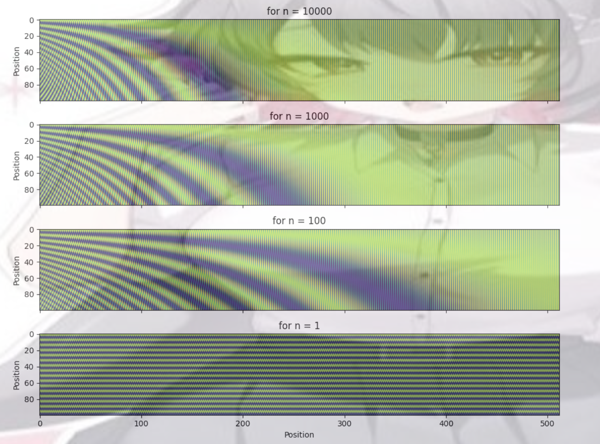

# Neural Machine Translation by Jointly Learning to Align and Translate https://arxiv.org/pdf/1409.0473

## Novelty

- The first paper to introduce the attention mechanism in neural machine translation.
- It proposed an attention mechanism that dynamically computes a context vector for each target word with respect to the source sentence, allowing the decoder to focus on the relevant parts of the source sentence.
- It shifts from static encoding to a flexible alignment-based approach. Minicing human translation by "attending" the target to the relevant parts of the source.

## Architecture

**Attention**

1. Alignment Scores: For each decoder step i, compute an alignment score $e_{ij}$ between the decoder's previous hidden state $s_{i-1}$ and each encoder hidden state $h_j$

$$
\begin{align*}
&e_{ij} = a(s_{i-1}, h_j) \\
&  a(s_{i-1}, h_j) = v^T \tanh(W_1 s_{i-1} + W_2 h_j) \\
\end{align*}
$$


$$
\begin{align*}
& \text{where:} \\
&\bullet \quad s_{i-1} \in \mathbb{R}^{h} \text{ (decoder hidden state at time step i-1)} \\
&\bullet \quad h_j \in \mathbb{R}^{h} \text{ (encoder hidden state at time step j)} \\
&\bullet \quad v \in \mathbb{R}^{h} \text{ (learned alignment model parameters)} \\
&\bullet \quad W_1 \in \mathbb{R}^{h \times h} \text{ (learned alignment model parameters)} \\
&\bullet \quad W_2 \in \mathbb{R}^{h \times h} \text{ (learned alignment model parameters)} \\
\end{align*}

$$

2. Attention Weights: Compute the attention weights $\alpha_{ij}$ as the softmax of the alignment scores:

$$
\alpha_{ij} = \frac{\exp(e_{ij})}{\sum_{k=1}^{T_x} \exp(e_{ik})}
$$

3. Context Vector: Compute the context vector $c_i$ as the weighted sum of the encoder hidden states:

$$
c_i = \sum_{j=1}^{T_x} \alpha_{ij} h_j
$$

4. Decoder Update: Update the decoder hidden state $s_i$ using the context vector $c_i$ and the previous hidden state $s_{i-1} and the previous target word $y_{i-1}$:

$$
s_i = f(s_{i-1}, y_{i-1}, c_i)\\
$$


$$
\quad \quad \text{where $f$ is typically a RNN}
$$

5. Output Prediction: Compute the output prediction $y_i$ as the result of the decoder hidden state $s_i$, the context vector $c_i$ and the previous target word $y_{i-1}$:

$$
p(y_i = j | y_{<i}, x) = g(s_i, y_{i-1}, c_i)
$$


## Code Implementation

** Attention Mechanism in PyTorch **

```python
import torch
import torch.nn as nn

class Attention(nn.Module):
    def __init__(self, decoder_dim, encoder_dim, attention_dim):
        super().__init__()
        self.W_a = nn.Linear(decoder_dim, attention_dim)  # Transform decoder state
        self.U_a = nn.Linear(encoder_dim, attention_dim)  # Transform encoder states
        self.v_a = nn.Linear(attention_dim, 1)            # Score projection

    def forward(self, s_prev, encoder_outputs):
        # s_prev: [batch_size, decoder_dim]
        # encoder_outputs: [batch_size, seq_len, encoder_dim]
        
        # Expand s_prev for broadcasting: [batch_size, 1, decoder_dim]
        s_prev = s_prev.unsqueeze(1)
        
        # Compute alignment scores
        energy = torch.tanh(self.W_a(s_prev) + self.U_a(encoder_outputs))  # [batch_size, seq_len, attention_dim]
        scores = self.v_a(energy).squeeze(-1)  # [batch_size, seq_len]
        
        # Attention weights
        attn_weights = torch.softmax(scores, dim=-1)  # [batch_size, seq_len]
        
        # Context vector
        context = torch.bmm(attn_weights.unsqueeze(1), encoder_outputs)  # [batch_size, 1, encoder_dim]
        return context.squeeze(1), attn_weights

# Example usage
batch_size, seq_len, enc_dim, dec_dim = 2, 5, 64, 128
encoder_outputs = torch.randn(batch_size, seq_len, enc_dim)
s_prev = torch.randn(batch_size, dec_dim)
attention = BahdanauAttention(dec_dim, enc_dim, 256)
context, weights = attention(s_prev, encoder_outputs)
print(context.shape)  # [batch_size, enc_dim]
print(weights.shape)  # [batch_size, seq_len]
```


# Attention is All You Need https://arxiv.org/pdf/1706.03762

## Novelty

- Eliminates the need of recurrent networks for sequnetial processing. This shifts enable parallelization and faster training.
- It introduces the concept of self-attention. It allows each token to attend to all other tokens in the sequence.

## Architecture

### Word Embedding

In the original experiment, the word embeddings are trained during the training, and the word embeddings are scaled by $\sqrt{d_k}$ where $d_k$ is the dimension of the word embeddings. 

Scaling down the embeddings helps with the stability of the training. Because the attention scores are calculated by the dot product of the linear transformations of the embeddings, scaling down the embeddings prevents the dot product from becoming too large, and thus preventing the softmax saturation.

```python
class WordEmbedding(nn.Module):
    
    def __init__(self, vocab_size, d_model, dropout=0.1):
        
        super().__init__()
        self.d_model = d_model
        self.embedding = nn.Embedding(vocab_size, d_model)
        self.dropout = nn.Dropout(dropout)
    def forward(self, x):
        
        return self.embedding(x) * math.sqrt(self.d_model)

```

## Positional Encoding

Without positional encoding, the attention model would not be able to capture the position of the tokens in the sequence. For instance, the attention score between "I" and "you" would be the same in "I love you" and "You love me".

In the original paper, the positional encoding is a sine and cosine function:

$$
PE(pos, 2i) = sin(pos / 10000^{2i/d_{model}})\\
PE(pos, 2i+1) = cos(pos / 10000^{2i/d_{model}})
$$


The choice of $10000^{2i/d_{model}}$ is to control the wavelength of the sine and cosine functions, and therefore covers both the short-range and long-range dependencies.

$$
\begin{align*}
& \text{For } d_{model} = 512, \\

& \bullet \text{At i = 0, the wavelength is } 10000^{0/512} \cdot 2 \pi = 2 \pi \\
& \bullet \text{At i = 512, the wavelength is } 10000^{512/512} \cdot 2 \pi = 20000 \pi \\
\end{align*}
$$



As we can see, for lower dimensions, the positional encoding oscillates faster, which means it captures the short-range dependencies better. And for higher dimensions, the positional encoding oscillates slower, which means it captures the broader-range dependencies better.

```python
class Positional_Encoding(nn.Module):
    
    def __init__(self, max_seq_len, d_model, dropout):
        
        super().__init__()
        
        pe = torch.zeros((max_seq_len, d_model))
        
        pos = torch.arange(0, max_seq_len, 1).unsqueeze(1).repeat(1, d_model)
        
        div = torch.arange(0, d_model, 2) / d_model
        
        div = torch.pow(10000, div).unsqueeze(0)
        
        pe[:, 0::2] = torch.sin(pos[:, 0::2] / div)
        
        pe[:, 1::2] = torch.cos(pos[:, 0::2]/div)
        
        self.pe = pe.unsqueeze(0).to('cuda')
        self.dropout = nn.Dropout(dropout)
    
    def forward(self, x):
        
        return self.dropout(x + self.pe[:, 0: x.shape[1], :].requires_grad_(False))
```


