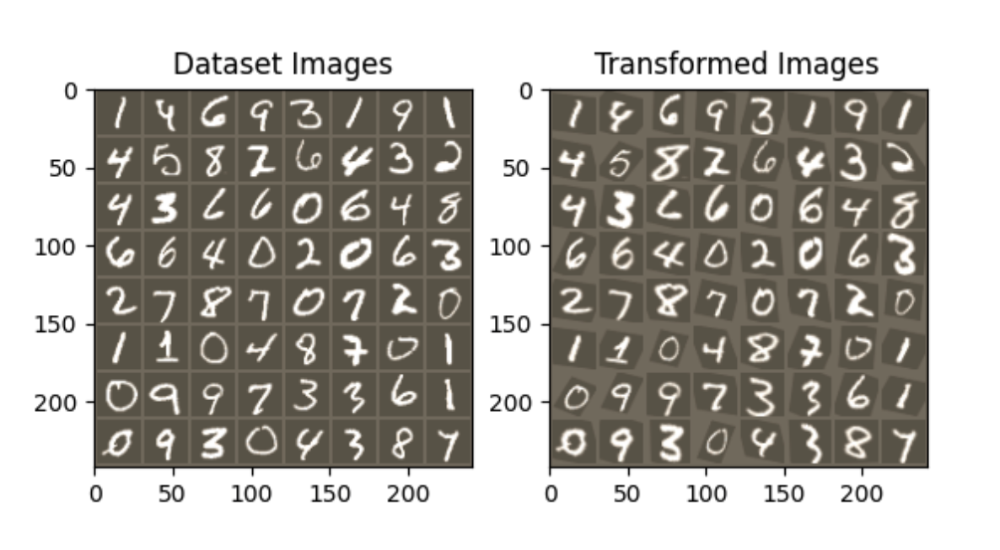

# Convolutional Neural Networks

## Spatial Transformer Networks  https://arxiv.org/pdf/1506.02025


### Novelty:

- Spatial Transformer Networks can be used as a pre-processing step to the CNN to make it more robust to the spatial transformation.
- The spatial transformer network (STN) is often used at the first layer of the network. It transforms the input image to a canonical form, and then feed into the CNN.
- Affine transformation is used to transform the input image. And the transformation matrix is learned by the network.

### Architecture:

The spatial transformer network (STN) consists of three parts:

1. Localization Network:
    - It is a network (can be a CNN, FCN, RNN, etc.) that outputs the parameters for the affine transformation matrix.

2. Grid Generator (Affine Transformation):
    - Apply the affine transformation to the input image.

3. Grid Sampler:
    - It samples the input image using the grid of coordinates.
    - A common sampling method is bilinear interpolation.

### Image Comparion between original and STN:



Based on the above image, we can see that the STN is able to transform the input image to a "canonical form". In which, the images of the same digits are more aligned in terms of rotation. We can conclude that STN helps to mitigate the problem of the CNN being sensitive to the spatial transformation like rotation.

### Code:

```python

class Net(nn.Module):
    def __init__(self):
        super(Net, self).__init__()
        self.conv1 = nn.Conv2d(1, 10, kernel_size=5)
        self.conv2 = nn.Conv2d(10, 20, kernel_size=5)
        self.conv2_drop = nn.Dropout2d()
        self.fc1 = nn.Linear(320, 50)
        self.fc2 = nn.Linear(50, 10)

        # Spatial transformer localization-network
        self.localization = nn.Sequential(
            nn.Conv2d(1, 8, kernel_size=7),
            nn.MaxPool2d(2, stride=2),
            nn.ReLU(True),
            nn.Conv2d(8, 10, kernel_size=5),
            nn.MaxPool2d(2, stride=2),
            nn.ReLU(True)
        )

        # Regressor for the 3 * 2 affine matrix
        self.fc_loc = nn.Sequential(
            nn.Linear(10 * 3 * 3, 32),
            nn.ReLU(True),
            nn.Linear(32, 3 * 2)
        )

        # Initialize the weights/bias with identity transformation
        self.fc_loc[2].weight.data.zero_()
        self.fc_loc[2].bias.data.copy_(torch.tensor([1, 0, 0, 0, 1, 0], dtype=torch.float))

    # Spatial transformer network forward function
    def stn(self, x):
        xs = self.localization(x)
        xs = xs.view(-1, 10 * 3 * 3)
        theta = self.fc_loc(xs)
        theta = theta.view(-1, 2, 3)

        grid = F.affine_grid(theta, x.size())
        x = F.grid_sample(x, grid)

        return x

    def forward(self, x):
        # transform the input
        x = self.stn(x)

        # Perform the usual forward pass
        x = F.relu(F.max_pool2d(self.conv1(x), 2))
        x = F.relu(F.max_pool2d(self.conv2_drop(self.conv2(x)), 2))
        x = x.view(-1, 320)
        x = F.relu(self.fc1(x))
        x = F.dropout(x, training=self.training)
        x = self.fc2(x)
        return F.log_softmax(x, dim=1)


model = Net().to(device)

```

## Residual Networks https://arxiv.org/pdf/1512.03385


### Novelty:

- Identity Mapping: The theory of the residual block is based on the idea that adding extra layers of identity mapping will not make the performance of the network degrade. Thus, the network can be made deeper without the degradation of the performance.
- Residual Block: The authors leveraged the identiy mapping theory in a clearer way and transformed the problem to be learning residual mappings, which has imrpoved gradient flow.

### Architecture:

**Residual Block:**


As the above image shows, the residual block is a building block of the ResNet. It takes  input $x$ and first outputs $F(x)$. The $F(x)$ is the residual mapping that is learned by the network. By adding the identity mapping $x$, it makes $F(x) + x = H(x)$, where $H(x)$ is the final output and the desired underlying mapping of the residual block.

**Intuition:**

- **Why authors suggested that adding extra layers of identity mapping will not make the performance of the network degrade?**


Suppose we have a shallow network, and a deeper network that is a composition of the shallow network and with added layers of identity mapping, plus a final layer of linear transformation.

As shown in the above image, if the extra layers are identity mapping, then the deeper network will generate the same output at extra layer 2 as the output of the shallow network at layer 2. And theoretically, layer 3 and output layer will get better result with sophisticated training.

Therefore, theoretically, the deeper network with extra layers ofidentity mapping will not degrade the performance of the shallow network.

- **Why $H(x)=F(x)+x$ is better than $F(x)$ from gradient analysis perspective?**

Let $x$ be the output of the previous layers. And $L$ is the loss function of the block.

Gradient of Loss with respect to $x$ for $F(x)$:

$$
\frac{\partial L}{\partial x} = \frac{\partial L}{\partial F(x)} \cdot \frac{\partial F(x)}{\partial x}
$$

Gradient of Loss with respect to $x$ for $H(x)=F(x)+x$:

$$
\frac{\partial L}{\partial x} = \frac{\partial L}{\partial H(x)} \cdot \frac{\partial H(x)}{\partial x} = \frac{\partial L}{\partial H(x)} \cdot (1 + \frac{\partial F(x)}{\partial x})
$$


As we can see that the RHS of the product for $H(x)$ has extra term of 1, this will guarentee the gradient more resilient to be vanished. It becomes obvious with a longer sequence.
Let $(F_1,F_2,F_3,..., F_n)$ be the sequence of identity mapping functions, and  $(H_1,H_2,H_3,..., H_n)$ be the sequence of residual functions, where $H_i(x)=H_{i-1}(x)+F_i(x)$, and $H_0(x)=x$.

Gradient of Loss with respect to $x$ for $(F_1,F_2,F_3,..., F_n)$:


$$
\begin{align*}
\frac{\partial L}{\partial x}
& = \frac{\partial L}{\partial F_n(x)} \cdot ( \frac{\partial F_{n}(x)}{\partial F_{n-1}(x)}) \cdot ( \frac{\partial F_{n-1}(x)}{\partial F_{n-2}(x)}) \cdots ( \frac{\partial F_1(x)}{\partial x}) \\
& =  \frac{\partial L}{\partial F_n(x)} \cdot  \frac{\partial F_1(x)}{\partial x}  \prod_{i=2}^{n-1}  \frac{\partial F_i(x)}{\partial F_{i-1}(x)}
\end{align*}
$$

Gradient of Loss with respect to $x$ for $(H_1,H_2,H_3,..., H_n)$:

$$
\begin{align*}
\frac{\partial L}{\partial x} 
& = \frac{\partial L}{\partial H_n(x)} \cdot (\frac{\partial H_{n}(x)}{\partial H_{n-1}(x)}) \cdot ( \frac{\partial H_{n-1}(x)}{\partial H_{n-2}(x)}) \cdots ( \frac{\partial H_1(x)}{\partial x})\\
&= \frac{\partial L}{\partial H_n(x)} \cdot (\frac{\partial H_{n-1}(x) + F_{n}(x)}{\partial H_{n-1}(x)}) \cdot ( \frac{\partial H_{n-2}(x) + F_{n-1}(x)}{\partial H_{n-2}(x)}) \cdots ( \frac{\partial H_0(x) + F_1(x)}{\partial x})\\
& = \frac{\partial L}{\partial H_n(x)} (1+ \frac{\partial F_1(x)}{\partial x}) \prod_{i=2}^{n-1} (1 + \frac{\partial F_i(x)}{\partial H_{i-1}(x)})
\end{align*}
$$  


As we can see, the graident for identity mapping function is more likely to be vanished. On the other hand, the gradient for residual function will not face the vanishing gradient problem. However, the gradient for residual function is more likely to explode. Based on the empirical experiements, applying the batch normalization to each convolution layer can help to stabilize the gradient.


