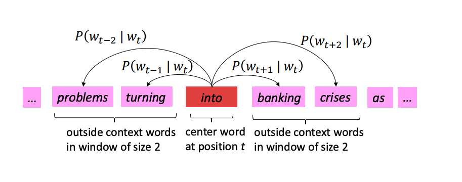

# Word Embeddings

## Distributed Representations of Words in Vector Space https://arxiv.org/pdf/1310.4546

### Novelty

- Negative Sampling: Use the negative sampling to approximate the softmax function, which is computationally efficient.
- Subsampling of Frequent Words: 

### Architecture

#### Skip-gram

It predicts the probability of the context words from the center word.

**Objective function:**
$$
- \sum_{t=1}^{T} \sum_{-m \leq j \leq m, j \neq 0} \log P(w_{t+j} | w_t; \theta)
$$

#### Computation of Probability

**Naive softmax:**
$$
\begin{align*}
P(o | c) &= \frac{\exp(u_o^T v_c)}{\sum_{w\in V} \exp(u_w^T v_c)}\\
\end{align*}
$$

where $u_o$ is the output vector of the context word, and $v_c$ is the input vector of the center word.

From the above "softmax" function, we see that the denominator (normalization factor) is the sum of the dot product of the output vector and the input vector of all the words in the vocabulary, which could be computationally expensive.

**Noise Contrastive Estimation (NCE):**

NCE provides an efficient way to approximate the softmax function.

It defines a binary classification problem between the target word and the noise words (sampled from the noise distribution).

Denote $P(C=1)$ to be the probability of the "real"word. And $P(C=0)$ to be the probability of the noise word. And suppose that $u$ is sampled from a dataset where as the number of noise words is $k$ times the number of real words in the dataset.

Then, we have the following posterior probability:
$$
\begin{align*}
P(C=1|u) &= \frac{P(u; C=1)}{P(u)}\\
&= \frac{P(u|C=1)P(C=1)}{P(u|C=1)P(C=1) + P(u|C=0)P(C=0)}\\
&= \frac{P(u|C=1)P(C=1)}{P(u|C=1)P(C=1) + kP(u|C=0)P(C=0)}\\
&= \frac{1}{1 + \frac{kP(u|C=0)}{P(u|C=1)}}\\
&= \frac{1}{1 + e^{ -(\ln P(u|C=1) - k\ln P(u|C=0))}}\\
&= \sigma(\ln P(u|C=1) - k\ln P(u|C=0))\\

\end{align*}
$$

Similarly, we have:
$$
\begin{align*}
P(C=0|u) &= \sigma(-\frac{1}{k}\ln P(u|C=1) + \ln P(u|C=0))\\

\end{align*}
$$

**Negative Sampling(NEG):**

We want to have "precise" prediction of  Based on the above NCE, construct the following loss function which maxize the log-likelihood of the real word prediction when the real word is sampled and maximized the log-likelihood of the noise word prediction when the noise word is sampled. Denote $u^+$ to be the real word, and $u^-$ to be the noise word. (Note that the there are $k$ times more noise words than real words in the dataset, so we need to sample $k$ noise words for each draw of the real word ):
$$
\begin{align*}
-\mathcal{L} &=  \mathbb{E}_{u^+ \sim P(u^+)} \log P(C=1|u^+) + \sum_{i=1}^{k} \mathbb{E}_{u_i^- \sim P(u^-)} \log P(C=0|u_i^-)\\

&= \mathbb{E}_{u^+ \sim P(u^+)} \log \sigma(\ln P(u^+|C=1) - k\ln P(u^+|C=0)) + \sum_{i=1}^{k} \mathbb{E}_{u_i^- \sim P(u^-)} \log \sigma(\ln P(u_i^-|C=0) -\frac{1}{k} \ln P(u_i^-|C=1))\\
&\approx \mathbb{E}_{u^+ \sim P(u^+)} \log \sigma(\ln P(u^+|C=1)) + \sum_{i=1}^{k} \mathbb{E}_{u_i^- \sim P(u^-)} \log \sigma(\ln P(u_i^-|C=0)) \quad \text{(we assume the chance of wrong prediction is negligible)}\\
\end{align*}
$$

(Translate to the softmax function of the original word2vec heuristically)

So, if we consider $u_o^Tv_t \text{ as } \ln P(u^+|C=1)$ and $-u_i^Tv_t \text{ as } \ln P(u_i^-|C=0)$, we have:
$$
\begin{align*}
-\mathcal{L} &= \log \sigma(u_o^Tv_t) + \sum_{i=1}^{k} \mathbb{E}_{u_i^ \sim P(u^-)} \log \sigma(-u_i^Tv_t)\\

\end{align*}
$$

**Subsampling of Frequent Words:**

The intuition is that frequent words are more likely to be sampled as noise words, so we want to subsample them by discarding them with a probability:

$$
P(w_i) = 1- \sqrt{\frac{t}{f(w_i)}}\\
$$

where $f(w_i)$ is the frequency of the word $w_i$ in the dataset, and $t$ is a hyperparameter. In the paper, $t=10^{-5}$. So, if the frequency of the word $w_i$ is greater than $10^{-5}$, we completely ignore it.

